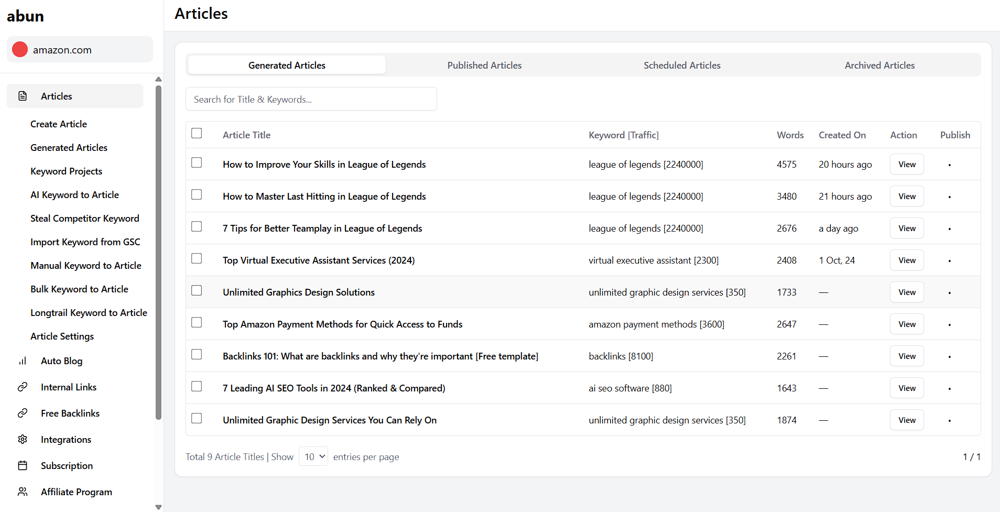

# Abun Dashboard

A modern, responsive content management dashboard built with React, TypeScript and shadcn/ui components. This dashboard allows users to manage articles, view analytics, and publish content to their websites.



## Features

- Article management with categorization (Generated, Published, Scheduled, Archived)
- Sidebar navigation with expandable sub-menus
- Search functionality for articles
- Content publishing workflow
- Responsive design for desktop and mobile
- Data visualization for content performance

## Tech Stack

- **React**: UI library for building the interface
- **TypeScript**: Type-safe JavaScript
- **shadcn/ui**: Component library for UI elements
- **Tailwind CSS**: Utility-first CSS framework for styling
- **Lucide Icons**: SVG icon library

## Getting Started

### Prerequisites

- Node.js (v16 or higher)
- npm or yarn

### Installation

1. Clone the repository:
```bash
git clone https://github.com/your-username/shadcn-dashboard.git
cd abun-dashboard
```

2. Install dependencies:
```bash
npm install
# or
yarn install
```

3. Install required shadcn/ui components:
```bash
npx shadcn@latest add table button input tabs badge card dropdown-menu
```

4. Start the development server:
```bash
npm run dev
# or
yarn dev
```

5. Open your browser and navigate to `http://localhost:3000`

Project Structure
/src
  /components
    /ui
      avatar.tsx
      badge.tsx
      button.tsx
      card.tsx
      dropdown-menu.tsx
      input.tsx
      seperator.tsx
      sheet.tsx
      table.tsx
      tabs.tsx
  /lib
    utils.ts  # Utility functions
  /pages
    Dashboard.jsx  # Main dashboard component  
  App.jsx
  main.jsx

## Component Guide

### Dashboard

The main dashboard component that displays the article management interface. It includes:

- Sidebar with navigation items
- Article table with search functionality
- Tabs for different article states
- Publication controls

### Usage

```jsx
import Dashboard from './app/dashboard/page';

export default function App() {
  return <Dashboard />;
}
```

## Customization

### Adding New Sidebar Items

To add new items to the sidebar, modify the `sidebarItems` array in the Dashboard component:

```jsx
const sidebarItems = [
  { id: "new-item", label: "New Item", icon: <YourIcon className="h-5 w-5" /> },
  // ... existing items
];
```

### Adding Article Data

To add or modify article data, update the `articles` array in the Dashboard component:

```jsx
const articles = [
  { 
    id: 10, 
    title: "Your New Article", 
    keyword: "your keyword [traffic]", 
    words: 1500, 
    createdOn: "just now" 
  },
  // ... existing articles
];
```

## Troubleshooting

### Component Import Errors

If you encounter errors like `Cannot find module '@/components/ui/tabs'`, make sure you've installed all the required shadcn/ui components:

```bash
npx shadcn-ui@latest add table button input tabs badge card dropdown-menu
```

### Path Alias Issues

If you're having issues with the `@/` path alias, make sure your `tsconfig.json` includes:

```json
{
  "compilerOptions": {
    "baseUrl": ".",
    "paths": {
      "@/*": ["./*"]
    }
  }
}
```

## License

MIT

## Contributing

Contributions are welcome! Please feel free to submit a Pull Request.